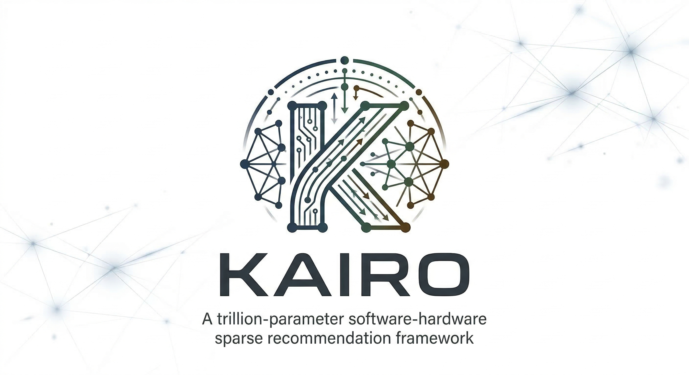

<a id="readme-top"></a>

<!-- PROJECT LOGO -->
<div align="center">
  
</div>

<br />

<!-- PROJECT SHIELDS -->
<div align="center">

[![Python][python-shield]][python-url]
[![PyTorch][pytorch-shield]][pytorch-url]
[![License][license-shield]][license-url]
[![Claude Code][claude-shield]][claude-url]

</div>

<div align="center">

  <h3 align="center">Kairo</h3>

  <p align="center">
    An end-to-end sparse computation framework for trillion-parameter recommendation systems.
    <br />
    <br />
    <a href="https://github.com/Kairo-oss/Kairo/issues/new?labels=bug">Report Bug</a>
    &middot;
    <a href="https://github.com/Kairo-oss/Kairo/issues/new?labels=enhancement">Request Feature</a>
  </p>
</div>

<!-- TABLE OF CONTENTS -->
<details>
  <summary>Table of Contents</summary>
  <ol>
    <li><a href="#about-the-project">About The Project</a></li>
    <li><a href="#features">Features</a></li>
    <li>
      <a href="#getting-started">Getting Started</a>
      <ul>
        <li><a href="#prerequisites">Prerequisites</a></li>
        <li><a href="#installation">Installation</a></li>
      </ul>
    </li>
    <li><a href="#usage">Usage</a></li>
    <li><a href="#architecture">Architecture</a></li>
    <li><a href="#technical-approach">Technical Approach</a></li>
    <li><a href="#roadmap">Roadmap</a></li>
    <li><a href="#comparison-with-sota">Comparison with SOTA</a></li>
    <li><a href="#repository-structure">Repository Structure</a></li>
    <li><a href="#contributing">Contributing</a></li>
    <li><a href="#license">License</a></li>
    <li><a href="#acknowledgments">Acknowledgments</a></li>
  </ol>
</details>

---

## About The Project

In the trillion-parameter era of Deep Learning Recommendation Models (DLRM), brute-force scaling has hit physical and energy-efficiency limits. Existing systems face storage explosion with ultra-large embedding tables, low computational efficiency in feature interaction, and poor hardware utilization due to static scheduling.

**Kairo** tackles these challenges through an end-to-end sparse design philosophy &mdash; combining semantic-driven storage compression, task-aware linear interaction architectures, and software-hardware codesign for dynamic scheduling. The result is a framework that achieves coordinated optimization across space, time, and accuracy dimensions.

### Built With

[![Python][python-shield]][python-url]
[![PyTorch][pytorch-shield]][pytorch-url]

## Features

Kairo consists of four tightly coupled engines that address bottlenecks from memory access to high-level modeling:

- **Storage & Representation Engine** &mdash; Semantic-enhanced memory pool with Learning-to-Collide (LEAD) hash mapping, Memory Scaling Network (MSN) for dynamic parameter activation, and NMF-based data-driven initialization for optimal sparse connectivity from day one
- **Interaction Engine** &mdash; Task-aware dual-stream architecture featuring INFNet with task proxy tokens (reducing complexity from O(N&sup2;) to O(N&middot;K)) and HSTU with pointwise aggregated attention (5.3&ndash;15.2x faster than FlashAttention2 on 8192-length sequences)
- **Training & Compute Engine** &mdash; Bi-directional sparse optimization through SparseRec selective gradient training and AGENT adaptive gradient correction (5% accuracy improvement or 52.1% faster convergence)
- **Scheduling & System Engine** &mdash; Software-hardware codesign with ML-guided storage management (RecMG), dynamic graph scheduling (RecOS), and resource disaggregation (Prism) via RDMA

## Getting Started

### Prerequisites

- Python 3.10+
- [PyTorch](https://pytorch.org/) >= 2.2.0
- CUDA Toolkit >= 11.8 (optional, for GPU acceleration)

### Installation

```bash
git clone https://github.com/Kairo-oss/Kairo.git
cd Kairo
pip install -e ".[dev,test]"
```

## Usage

```python
from kairo.types import EmbeddingConfig
from kairo.config import NMFConfig
from kairo.storage.nmf import nmf_decompose, generate_sparse_mask
from kairo.storage import SparseEmbeddingTable

# 1. NMF decomposition on interaction matrix
config = NMFConfig(rank=64, max_iter=200, tol=1e-4)
result = nmf_decompose(interaction_matrix, config)

# 2. Generate sparse mask (80% sparsity)
mask = generate_sparse_mask(
    result, num_embeddings=100_000, embedding_dim=128, sparsity_ratio=0.8
)

# 3. Create sparse embedding table
emb_config = EmbeddingConfig(
    num_embeddings=100_000, embedding_dim=128, sparsity_ratio=0.8
)
table = SparseEmbeddingTable(emb_config, mask=mask)

# 4. Forward pass
output = table(input_ids)
print(f"Compression: {table.compression_ratio:.1%}")  # ~80%
```

## Architecture

```
┌─────────────────────────────────────────────────────────────────────┐
│                          Kairo Framework                            │
├─────────────────┬─────────────────┬────────────────┬────────────────┤
│   Storage &     │  Interaction    │  Training &    │  Scheduling &  │
│ Representation  │    Engine       │   Compute      │    System      │
│     Engine      │                 │    Engine      │    Engine      │
├─────────────────┼─────────────────┼────────────────┼────────────────┤
│ LEAD (Learning  │ INFNet (Task    │ SparseRec      │ RecMG (ML-     │
│  to Collide)    │  Proxy Tokens)  │ (Sparse Grads) │  guided Cache) │
│                 │                 │                │                │
│ MSN (Memory     │ HSTU (Pointwise │ AGENT (Grad    │ RecOS (Dynamic │
│  Scaling Net)   │  Aggregated     │  Correction)   │  Scheduling)   │
│                 │  Attention)     │                │                │
│ NMF (Data-      │                 │                │ Prism (RDMA    │
│  driven Init)   │                 │                │  Disaggregation│
└─────────────────┴─────────────────┴────────────────┴────────────────┘
```

## Technical Approach

### Engine 1: Storage & Representation &mdash; Semantic-Enhanced Memory Pool

- **LEAD (Learning to Collide)** &mdash; Unlike random hashing, LEAD trains a mapping function based on feature ID access frequency and semantic similarity (from historical interactions). It guides semantically similar IDs to proactively share representation space, achieving 80%+ storage reduction while enhancing generalization for long-tail IDs
- **MSN (Memory Scaling Network)** &mdash; An LLM-inspired memory retrieval mechanism. Stores trillion-scale parameters in a parameterized memory pool using Product Keys, activating only a tiny fraction via Memory Gating at inference time. Decouples model capacity from compute cost
- **NMF Data-Driven Initialization** &mdash; Uses Non-negative Matrix Factorization to decompose the raw interaction matrix at system startup, initializing the sparse mask matrix so that sparse connections start at a local optimum from day one

### Engine 2: Interaction &mdash; Task-Aware Dual-Stream Architecture

- **INFNet** &mdash; For multi-task learning (MTL), introduces Task Proxy Tokens that reduce feature interaction to cross-attention between feature tokens and a small set of proxy tokens. Reduces complexity from O(N&sup2;) to O(N&middot;K) where K is constant, effectively suppressing negative transfer between tasks
- **HSTU (Hierarchical Sequential Transduction Unit)** &mdash; Replaces expensive self-attention with Pointwise Aggregated Attention. Achieves 5.3&ndash;15.2x speedup over FlashAttention2-based Transformers on 8192-length user sequences

### Engine 3: Training & Compute &mdash; Bi-Directional Sparse Optimization

- **SparseRec** &mdash; Selective gradient computation during backpropagation. Uses Multinomial Sampling to select active IDs, computing gradients only for the selected subset. Maintains constant sparsity throughout the full training lifecycle (forward and backward), eliminating dense gradient table memory overhead
- **AGENT** &mdash; Adaptive gradient correction for high sparsity (e.g., 99%) scenarios where gradient variance is large and convergence is slow. Corrects the current direction using historical gradient momentum correlation, achieving 5.0% accuracy improvement or 52.1% faster convergence at equal epochs

### Engine 4: Scheduling & System &mdash; Software-Hardware Codesign

- **RecMG** &mdash; ML-guided tiered storage management for TB-scale models across GPU HBM/DRAM/SSD. Deploys dual ML models: a cache model captures temporal locality for eviction, a prefetch model predicts future access sequences. Reduces on-demand fetches by 2.8x, improves end-to-end inference time by 43%
- **RecOS** &mdash; Dynamic graph scheduling for high-concurrency operator overlap. Introduces unified async tensor management with cross-CUDA-Stream inter-op parallelization and operator fusion, reducing inference latency by 68% at peak traffic
- **Prism** &mdash; Resource disaggregation that deploys CPU-intensive subgraphs (Embedding Lookup) and GPU-intensive subgraphs (Attention/MLP) across physical nodes, enabling elastic scaling via RDMA

## Roadmap

Implementation follows four phases, progressively building from infrastructure to automation.

### Phase 1: Foundation &mdash; `In Progress`

> Core sparse training infrastructure and high-performance kernels.

| Component | Description | Status |
|-----------|-------------|--------|
| NMF Initialization | Data-driven sparse mask initialization via matrix factorization | Done |
| SparseEmbeddingTable | Embedding table with COO-format sparse mask support | Done |
| SparseRec | Selective gradient training with multinomial active-ID sampling | Planned |
| AGENT Optimizer | Adaptive gradient correction with historical momentum | Planned |
| Acc-SpMM CUDA Kernel | Block-sparse matrix multiplication optimized for Tensor Cores | Planned |
| Sparse Embedding Kernel | CUDA kernels for sparse embedding forward/backward | Planned |
| SparseTrainer | Integrated training loop orchestrating all Phase 1 components | Planned |

### Phase 2: Architecture &mdash; `Planned`

> Advanced interaction and sequence modeling architectures.

| Component | Description | Status |
|-----------|-------------|--------|
| INFNet | Task proxy token mechanism for O(N&middot;K) multi-task interaction | Planned |
| HSTU | Hierarchical Sequential Transduction Unit for ultra-long user sequences | Planned |
| Multi-Modal Input | Unified feature input pipeline for text, image, and categorical features | Planned |

### Phase 3: Ecosystem &mdash; `Planned`

> System-aware optimization for production heterogeneous hardware.

| Component | Description | Status |
|-----------|-------------|--------|
| RecMG | ML-guided tiered storage across HBM and NVMe for trillion parameters | Planned |
| RecOS | Dynamic graph scheduling with auto operator alignment for A800/RTX 4090 | Planned |
| Prism | CPU/GPU resource disaggregation with RDMA elastic scaling | Planned |

### Phase 4: Evolution &mdash; `Planned`

> Automated architecture search and self-optimization.

| Component | Description | Status |
|-----------|-------------|--------|
| PEL-NAS | LLM-driven architecture search with complexity partitioning engine | Planned |
| Device Adaptation | Minute-level optimal Kairo variant generation for edge NPU or cloud GPU | Planned |

## Comparison with SOTA

| Dimension | Traditional (Monolith/DLRMv2) | Kairo | Improvement |
|-----------|-------------------------------|-------|-------------|
| Collision Handling | Collision-free hashing (linear storage growth) | Learning to Collide (LEAD) | 80%+ storage reduction |
| Gradient Computation | Sparse weights + dense gradients (memory bottleneck) | Bi-directional sparse training (SparseRec) | 70% training memory reduction |
| Feature Interaction | Fully-connected O(N&sup2;) | Proxy token interaction O(N&middot;K) | 2x multi-modal performance |
| Storage Strategy | Static cache or LRU (prediction blind spot) | ML-guided prefetch & cache (RecMG) | 2.8x fewer on-demand fetches |
| Sequence Modeling | Transformer (quadratic complexity) | HSTU (linear + pointwise aggregation) | 10x+ long sequence speedup |
| Resource Scheduling | Static compute graph (serial/blocking operators) | Dynamic graph + resource disaggregation (Prism/RecOS) | 68% latency reduction at peak |

## Repository Structure

```
Kairo/
├── kairo/
│   ├── __init__.py              Package init
│   ├── types.py                 Frozen dataclasses (SparseMask, NMFResult, etc.)
│   ├── config.py                Configuration dataclasses
│   └── storage/                 Storage & Representation Engine
│       ├── nmf/
│       │   ├── factorizer.py    NMF decomposition
│       │   └── mask_init.py     Sparse mask generation
│       └── embedding.py         SparseEmbeddingTable
├── tests/                       Unit + integration tests
├── examples/                    Usage examples
├── pyproject.toml               Build configuration
└── LICENSE                      MIT License
```

## Contributing

Contributions are what make the open source community such an amazing place to learn, inspire, and create. Any contributions you make are **greatly appreciated**.

1. Fork the Project
2. Create your Feature Branch (`git checkout -b feature/amazing-feature`)
3. Commit your Changes (`git commit -m 'feat: add amazing feature'`)
4. Push to the Branch (`git push origin feature/amazing-feature`)
5. Open a Pull Request

## License

Distributed under the MIT License. See [LICENSE](LICENSE) for more information.

## Acknowledgments

- [SparseRec](https://link.springer.com/article/10.1007/s41019-025-00327-5) &mdash; Sparse gradient training for recommender systems
- [AGENT](https://arxiv.org/abs/2301.03573) &mdash; Accelerating sparse training via adaptive gradient correction
- [HSTU](https://arxiv.org/abs/2402.17152) &mdash; Actions speak louder than words
- [LEAD](https://arxiv.org/abs/2203.15837) &mdash; Learning to collide
- [INFNet](https://arxiv.org/abs/2508.11565) &mdash; Task-aware information flow network

<p align="right"><a href="#readme-top">TOP</a></p>

<!-- MARKDOWN LINKS & IMAGES -->
[python-shield]: https://img.shields.io/badge/Python-3.10+-3776ab?style=for-the-badge&logo=python&logoColor=white
[python-url]: https://www.python.org/
[pytorch-shield]: https://img.shields.io/badge/PyTorch-2.2+-ee4c2c?style=for-the-badge&logo=pytorch&logoColor=white
[pytorch-url]: https://pytorch.org/
[license-shield]: https://img.shields.io/badge/License-MIT-green?style=for-the-badge
[license-url]: https://opensource.org/licenses/MIT
[claude-shield]: https://img.shields.io/badge/Claude_Code-Powered-cc785c?style=for-the-badge&logo=anthropic&logoColor=white
[claude-url]: https://claude.ai/code
